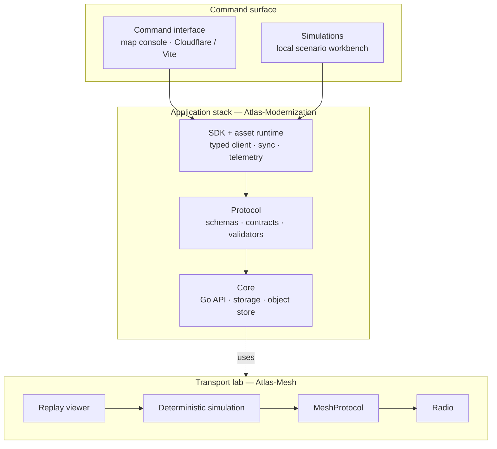

  

---

### Lately

<!-- profile:lately:start -->
| Project | Notes |
|:--|:--|
| [**Atlas-Modernization**](https://github.com/the-Drunken-coder/Atlas-Modernization) | App stack rewrite — core, protocol, SDK, plugins, command UI, simulations |
| [**DCS**](https://github.com/the-Drunken-coder/DCS) | Small personal Codex skills library — review skills, architecture-map (0.13.0) |
| [**easymanet**](https://github.com/the-Drunken-coder/easymanet) | Zero-touch OpenMANET provisioning and imaging |
| [**sidc-kit**](https://github.com/the-Drunken-coder/sidc-kit) | Compact TypeScript toolkit for Symbol Identification Codes |
| [**Meshtastic-WIFI-bridge**](https://github.com/the-Drunken-coder/Meshtastic-WIFI-bridge) | Chunked, reliable Meshtastic transport with browser-over-mesh UI |
| [**Atlas-Mesh**](https://github.com/the-Drunken-coder/Atlas-Mesh) | Radio transport & mesh-routing lab under Atlas |
<!-- profile:lately:end -->

---

### About

I work on systems where the map, the radio, and the backend have to agree — Go/TypeScript services, map consoles, mesh transports, and the small libraries that keep those pieces interoperable. Prefer things you can run locally, measure, and replay.

---

### Atlas

Main effort. Two repos: the application rewrite, and the radio/mesh lab underneath it.

#### Modernization

[`Atlas-Modernization`](https://github.com/the-Drunken-coder/Atlas-Modernization) — one workspace for the rewrite:

| Layer | Role |
|:--|:--|
| **Core** | Go HTTP API, durable storage, object store |
| **Protocol** | Schemas, generated contracts, validators |
| **SDK & asset runtime** | Typed client, sync, telemetry / command path |
| **Atlas Link** | Meshtastic Link service/SDK — Shared Picture, Tasks, radio transport |
| **Plugins** | Authoring runtime, first-party catalog, catalog releases |
| **Core CLI** | Default Ink action-list TUI for single-host `atlas-core` lifecycle and Plugin updates |
| **Command interface** | Map console on Cloudflare Pages / Vite |
| **Simulations** | Local scenario workbench + browser UI |

Recent focus: shipped the action-list Ink TUI as the default `atlas-core` operator surface — lifecycle ops, embedded logs/diagnostics, Core updates (backup-optional), and reviewed one-at-a-time Plugin updates (version and restart impact, progress, cancellation, recovery); recovery and terminal-output hardening around those flows. Continues independent Plugin releases (schema 4), Asset/Track movement history, and Meshtastic Link as the sole radio stack through Core v0.2.1; prior aggregate acceptance evidence across Core, SDK, Link, simulations, command interface, packed CLI, and containers still stands.

#### Mesh

[`Atlas-Mesh`](https://github.com/the-Drunken-coder/Atlas-Mesh) — narrower question: *how should bytes move between radios on an unreliable network?*

Architecture is intentionally thin: `Radio` → `MeshProtocol` → `Simulation` → web replay viewer. Direct strategies (ack, stop-and-wait, …) sit beside routing experiments (gateway-tree, controlled flooding, on-demand, quality-tree). Simulator is seeded and deterministic, including a measured Heltec V3 LoRa airtime model.

Latest: consolidated radio verification lab.

---

Updated 17 Sep 2026
